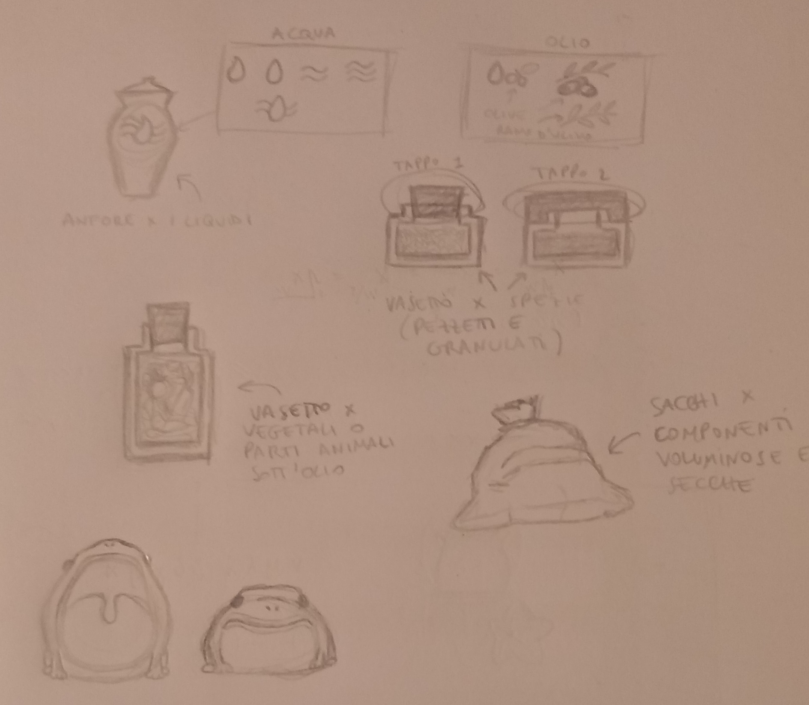
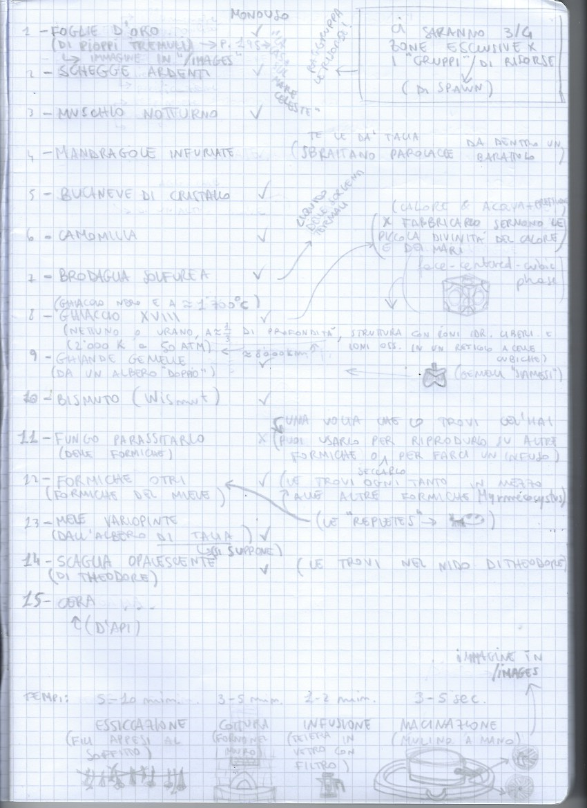

Vezzola Luca 4CI
================

__________________________________________________________________

Indice
======

- [Diario di bordo](#diario-di-bordo)
    - [25/11/2024](#25-novembre-2024)
    - [29/11/2024](#29-novembre-2024)
    - [2/12/2024](#2-dicembre-2024)
    - [7/12/2024](#7-dicembre-2024)
    - [9/12/2024](#9-dicembre-2024)
    - [14/12/2024](#14-dicembre-2024)
    - [16/12/2024](#16-dicembre-2024)
    - [21/12/2024](#21-dicembre-2024)
    - [24/12/2024](#24-dicembre-2024)
    - [27/12/2024](#27-dicembre-2024)
    - [19/12/2025](#19-gennaio-2025)
- [Idee per il gioco](#idee-per-il-gioco)
- [Legenda linguaggio Markdown](#legenda-linguaggio-markdown)

__________________________________________________________

_**Diario di bordo**_
===================

**25 novembre 2024**
--------------------

_**Log preview:**_

- **Cose fatte oggi:**
    1. Studio linguaggio Markdown;
    2. Definizione degli aspetti principali del gioco.
- **Sitografia**:
    - <https://www.html.it/articoli/markdown-guida-al-linguaggio/>

__________________________________________________________
_**Log completo:**_

1. Studio linguaggio di markdown da [questo link](https://www.html.it/articoli/markdown-guida-al-linguaggio/), ciò che ho imparato sul Markdown è scritto [qui](#x-legenda-linguaggio-markdown);
2. Puoi trovare la definizione degli aspetti principali del gioco [qui](#idee-iniziali).

__________________________________________________________

**29 novembre 2024**
--------------------

_**Log preview:**_

- **Cose fatte oggi:**
    1. Ricerca sull'alchimia e sulla sua storia, in funzione di una maggiore accuratezza storica nel gioco;
    2. Aggiunta all'idea del gioco di alcuni elementi fantastici e di ambientazioni presi dal libro [_"La casa sul mare celeste"_](https://it.wikipedia.org/wiki/La_casa_sul_mare_celeste).
- **Sitografia**:
    - <https://www.youtube.com/watch?v=1DCBVxH86OE>
    - <https://it.wikipedia.org/wiki/Prima_materia>
    - <https://en.wikipedia.org/wiki/Philosopher%27s_stone>

__________________________________________________________
_**Log completo:**_

1. Ricerca sull'alchimia e sulla sua storia, in funzione di una maggiore accuratezza storica nel gioco dai siti indicati nella sitografia, puoi vedere il materiale scritto [qui](#ricavate-da-i-learned-alchemy-from-medieval-manuscripts-heres-how-it-works);
2. Aggiunta all'idea del gioco di alcuni elementi fantastici e di ambientazioni dal libro [_"La casa sul mare celeste"_](https://it.wikipedia.org/wiki/La_casa_sul_mare_celeste), puoi vedere il materiale scritto [qui](#ricavate-da-la-casa-sul-mare-celeste).

__________________________________________________________

## **2 dicembre 2024**

_**Log preview:**_

- **Cose fatte oggi:**
    1. Ricerca delle librerie utili al progetto;
    2. Studio di JavaFX.
- **Sitografia**:
    - <https://aulab.it/guide-avanzate/javafx/>
    - <https://www.oracle.com/it/java/technologies/javase/javafx-overview.html>
    - <https://openjfx.io/javadoc/22/>

___________________________________________________________
_**Log completo:**_

1. Ricerca delle librerie utili al progetto da [questo sito](https://aulab.it/guide-avanzate/javafx/);
2. Studio di JavaFX con particolare attenzione alle seguenti funzionalità:
    - [path con orientazione del punto in movimento](https://openjfx.io/javadoc/22/javafx.graphics/javafx/animation/PathTransition.OrientationType.html);
    - [forme geometriche](https://openjfx.io/javadoc/22/javafx.graphics/javafx/geometry/package-summary.html)

___________________________________________________________

## **7 dicembre 2024**

_**Log preview:**_

- **Cose fatte oggi:**
    1. Ricerca sulla pixel art;
    2. Disegno di bozze di prova con GraphicsGale.
- **Sitografia**:
    - <https://graphicsgale.com/us/>
    - <https://www.youtube.com/watch?v=3dSspGMI7d4&ab_channel=DraginoffGaming>
    - <https://lospec.com/palette-list/blk-nx64>

___________________________________________________________
_**Log completo:**_

1. Ricerca sulla pixel art, grazie alla quale ho scoperto [GraphicsGale](https://graphicsgale.com/us/);
2. Disegno di bozze di prova con GraphicsGale ([esempio immagine](./images/callicarpa/callicarpa_full.png)).

___________________________________________________________

## **9 dicembre 2024**

_**Log preview:**_

- **Cose fatte oggi:**
    1. Ricerca sulla libreria libGDX;
    2. Download e set up dell'ambiente di sviluppo.
- **Sitografia**:
    - [LibGDX Source & Documentation](https://libgdx.com/dev/)
    - [Set Up a Dev Env](https://libgdx.com/wiki/start/setup)
        - [Link download Eclipse per Java](https://www.eclipse.org/downloads/download.php?file=/technology/epp/downloads/release/2024-12/R/eclipse-java-2024-12-R-win32-x86_64.zip)
    - [Create a project](https://libgdx.com/wiki/start/project-generation)

__________________________________________________________
_**Log completo:**_

1. Ricerca sulla libreria GDX, con pochi risultati;
2. Download e set up dell'ambiente di sviluppo (Eclipse + libGDX), non riuscito totalmente.

__________________________________________________________

## **14 dicembre 2024**

_**Log preview:**_

- **Cose fatte oggi:**
      1. Download e set up dell'ambiente di sviluppo;
      2. Studio di Git e GitHub;
      3. Utilizzo di Copilot per delineare la lista degi ingredienti che saranno poi presenti nel gioco.
- **Sitografia**:
    - [Set Up a Dev Env](https://libgdx.com/wiki/start/setup)
        - [Link download Eclipse per Java](https://www.eclipse.org/downloads/download.php?file=/technology/epp/downloads/release/2024-12/R/eclipse-java-2024-12-R-win32-x86_64.zip)
    - [Create a project](https://libgdx.com/wiki/start/project-generation)
    - [Repository GitHub del progetto](https://github.com/VezzolaLuca-MarconiVR/4_INFORMATICA_2024_25.git)
    - [Copilot](https://copilot.microsoft.com/)

__________________________________________________________
_**Log completo:**_

1. Download e set up dell'ambiente di sviluppo (Eclipse + libGDX) - questa volta è riuscito - e creazione dei file necessari al progetto tramite "gdx-liftoff";
2. Studio di Git e GitHub, salvataggio di una repository e successivo push su GitHub;
3. Utilizzo di Copilot per delineare la lista degi ingredienti che saranno poi presenti nel gioco, puoi leggere l'output di Copilot [qui](#copilot-14122024-2254).

__________________________________________________________

**16 dicembre 2024**
--------------------

_**Log preview:**_

- **Cose fatte oggi:**
    1. Ricerca rivolta alla comprensione della struttura dati di un progetto libGDX.
- **Sitografia**:
    - [Set Up a Dev Env](https://libgdx.com/wiki/start/setup)

__________________________________________________________
_**Log completo:**_

1. Ricerca rivolta alla comprensione della struttura dati di un progetto java creato con "gdx-liftoff".

__________________________________________________________

**21 dicembre 2024**
--------------------

_**Log preview:**_

- **Cose fatte oggi:**
    1. Creazione della classe MyGame;
    2. Definizione di tutti i "regni" e le loro "piccole divinità";
    3. Definizione degli ingredienti con l'aiuto di Copilot.
- **Sitografia**:
  - [Set Up a Dev Env](https://libgdx.com/wiki/start/setup)

__________________________________________________________
_**Log completo:**_

1. Creazione della classe MyGame (che estende a ApplicationAdapter), e implementazione tutti i metodi dell'interfaccia;
2. Definizione di tutti i "regni" e le loro "piccole divinità" (ognuna con le sue 3 caratteristiche), puoi trovarle [qui](#lista-dei-regni-con-le-loro-piccole-divinità-e-le-loro-piccole-caratteristiche);
3. Definizione degli ingredeinti necessari ad invocare le piccole divinità, puoi trovarli [qui](#copilot-14122024-2254).

__________________________________________________________

**24 dicembre 2024**
--------------------

**Log preview:**

- **Cose fatte oggi:**
    1. Testing per comprendere meglio il funzionamento di libGDX.
- **Sitografia**:
    - [Set Up a Dev Env](https://libgdx.com/wiki/start/setup)

__________________________________________________________
**Log completo:**

1. Testing per comprendere meglio il funzionamento di libGDX:
    - Creazione di un ambiente 2d dove ci si può muovere in tutte le direzioni.

__________________________________________________________

**27 dicembre 2024**
--------------------

**Log preview:**

- **Cose fatte oggi:**
    1. Definizione degli ingredienti e dei metodi di lavorazione degli stessi.
- **Sitografia**:
    - Tutte le ricerche sono state fatte su [Wikipedia](https://it.wikipedia.org/)

__________________________________________________________
_**Log completo:**_

1. Definizione degli ingredienti e dei metodi di lavorazione degli stessi, puoi trovare tutto [qui](#idee-finali).

__________________________________________________________

**19 gennaio 2025**
--------------------

**Log preview:**

- **Cose fatte oggi:**
    1. Definizione della struttura delle classi;
    2. Ri-definizione dello scopo del gioco.
- **Sitografia**:
    - " "

__________________________________________________________
_**Log completo:**_

1. Definizione della struttura delle classi all'interno del progetto mediante l'utilizzo di classi padre astratte;
2. Ri-definizione dello scopo del gioco - puoi trovarlo [qui](#idee-finali).

__________________________________________________________


_**Idee per il gioco**_
=====================

Sketches
--------

- oggetti e altro:
  

__________________________________________________________

Idee iniziali
-------------

- Strega/alchimista;
- Creare pozioni;
  - raccogliere o cacciare gli ingredienti;
  - sistema di storage (scaffali, vasi, sacchi di tela, ecc...)
  - "cestino" per eliminare gli ingredienti in eccesso (Bat e Race);
- Vendere pozioni;
- Sistema di ricompense alla "ruota della fortuna" con i tarocchi;
- Creare amuleti
  - Insetti
  - Portafoto indossabili
  - Gemme
- Totem per infondere "poteri" speciali o per iniziare i rituali.

__________________________________________________________

Ricavate da [_"I learned Alchemy from Medieval Manuscripts. Here's how it works:"_](https://www.youtube.com/watch?v=1DCBVxH86OE)
-----------------------------------------------------------------------------------

To pseudo Democritus, to make a desired substance you search for the qualities of that substance scattered throughout nature, collect together substances that each reflect one or more of the desired qualities, and use the art to join them together into one substance in a way that maintains those desired qualities. \
To pseudo Democritus, gold isnt neccesarily a distinct substance as much as it is a combination of the qualities that make it metallic, yellowish, flexible, fusible, and perhaps most importantly, noble or resistant to fire. \
Base metals like lead are already metallic, so you just need to alter their other qualities untill they match gold. \
His gold mimicking comes on a spectrum, the simplest recipes arent meant to make gold as much as they are just meant to make a metal look yellow, more complex ones aim to imitate more of golds qualities, and the most complex try to imitate golds ability to resist fire without rustng. \
It's not at all clear if he thinks this means hes actually made gold, or if more; so he sees his work as having overcome the undesirable or corrupt natures of base metals making them more gold-like.

__________________________________________________________

Ricavate da [_"La casa sul mare celeste"_](https://it.wikipedia.org/wiki/La_casa_sul_mare_celeste)
------------------------------------------

- un giardino con gazebo che dà sull'oceano, e una gnoma particolare;
  - _"lanterne di carta rosse e arancioni"_ dalla luce tremolante che tintinnano nel vento;
  - un _"sentiero di pietra"_ che, attraversando il giardino, porta al gazebo;
  - il giardino è molto rigoglioso;
    - all'interno del giardino _"Linus non vide girasoli, ma calle e gigli. Dalie. Celosie. Crisantemi, gerbere arancioni e campanule. [ ] delle callicarpe [ ]. L'aria era densa e fragrante, stordiva quasi."_ ;
  - un poco più in là _"[ ] cresceva un albero di mele, e Linus rimase interdetto vedendo frutti rossi, verdi e rosati, di tre varietà diverse, pendere dagli stessi rami."_ alla cui base vi era una gnoma da giardino che _"Aveva una folta barba bianca e le mani giunte"_ di nome Talia, dotata di una vanga e di pochissima pazienza;
- una viverna dagli occhi arancioni, Theodore;
  - descrizione, dal medesimo libro: le viverne sono rettili bipedi "poco più grandi di un gatto domestico", dotati di ali e di una complessità emotiva simile a quella umana, dalle scaglie opalescenti, che emette come verso una sorta di pigolio;
  - richiede un oggetto da aggiungere al suo tesoro, preferibilmente di grande valore o che appaia averne;

__________________________________________________________

**Lista dei regni con le loro piccole divinità e le loro piccole caratteristiche:**
-----------------------------------------------------------------------------------

1. Regno dell'Acqua

    - Piccola divinità dei Fiumi
        - scorrere, cambiare, purificare
    - Piccola divinità dei Laghi
        - contenere, resistere, soffermarsi
    - Piccola divinità dei Mari
        - celare, oscurare, unificare

2. Regno del Fuoco

    - Piccola divinità delle Fiamme
        - rischiare, consumare, arroganza
    - Piccola divinità del Calore
        - scottare, confortare, desiderare
    - Piccola divinità del Sole
        - illuminare, sicurezza, guida

3. Regno dell'Aria

    - Piccola divinità dei Venti
        - fluidità, mescolanza, libertà
    - Piccola divinità delle Nuvole
        - annebbiare, unicità, alleggerire
    - Piccola divinità dei Sentori
        - attrarre, respingere, rilassare

4. Regno della Terra

    - Piccola divinità dei Monti
        - superiorità, saggezza, durezza
    - Piccola divinità delle Colline
        - sinuosità, morbidezza, attenuazione
    - Piccola divinità delle Pianure
        - infinite direzioni, fondamenta, lucidità

5. Regno della Vita

    - Piccola divinità degli Animali
        - resilienza, comunità, alternatività
    - Piccola divinità delle Piante
        - flessibilità, vulnerabilità, crescita
    - Piccola divinità dei Funghi
        - costanza, bellezza, intelligenza

__________________________________________________________

_Copilot (14/12/2024 22:54)_
----------------------------

- _Input:_

```text
ciao, sto facendo un gioco e mi servirebbe che mi aiutassi a fare una lista di ingredienti (sono 15) dove ogni elemento ha 3 caratteristiche (uniche per quell'ingrediente, e non ne deve avere più di una appartenente allo stesso "Regno") appartenenti a diverse piccole divinità. Le piccole divinità sono 15 e sono suddivise in 5 regni (la struttura del testo è ##[Regno], - Nome piccola divinità, - caratteristiche): ## Regno dell'Acqua - Piccola divinità dei Fiumi - scorrere, cambiare, purificare - Piccola divinità dei Laghi - contenere, resistere, soffermarsi - Piccola divinità dei Mari - celare, oscurare, unificare ## Regno del Fuoco - Piccola divinità delle Fiamme - rischiare, consumare, arroganza - Piccola divinità del Calore - scottare, confortare, resistere - Piccola divinità del Sole - illuminare, sicurezza, guida ## Regno dell'Aria - Piccola divinità dei Venti - fluidità, mescolanza, libertà - Piccola divinità delle Nuvole - annebbiare, unicità, alleggerire - Piccola divinità dei Sentori - attrarre, respingere, rilassare ## Regno della Terra - Piccola divinità dei Monti - superiorità, saggezza, durezza - Piccola divinità delle Colline - sinuosità, morbidezza, attenuazione - Piccola divinità delle Pianure - infinite direzioni, fondamenta, lucidità ## Regno della Vita - Piccola divinità degli Animali - resilienza, comunità, alternatività - Piccola divinità delle Piante - flessibilità, vulnerabilità, crescita - Piccola divinità dei Funghi - costanza, bellezza, intelligenza
```

- _Output (sono 2; il secondo è il risultato di un tentativo di allineamento con il risultato voluto):_

```text
1. **Foglia d'Argento**
    - Scorrere (Regno dell'Acqua - Fiumi)
    - Fluidità (Regno dell'Aria - Venti)
    - Sicurezza (Regno del Fuoco - Sole)

2. **Pietra di Luna**
    - Celare (Regno dell'Acqua - Mari)
    - Saggezza (Regno della Terra - Monti)
    - Bellezza (Regno della Vita - Funghi)

3. **Erba di Sole**
    - Soffermarsi (Regno dell'Acqua - Laghi)
    - Confortare (Regno del Fuoco - Calore)
    - Crescita (Regno della Vita - Piante)

4. **Radice di Mandragola**
    - Resistere (Regno dell'Acqua - Laghi)
    - Oscurare (Regno dell'Acqua - Mari)
    - Fondamenta (Regno della Terra - Pianure)

5. **Fiore della Neve**
    - Purificare (Regno dell'Acqua - Fiumi)
    - Alleggerire (Regno dell'Aria - Nuvole)
    - Vulnerabilità (Regno della Vita - Piante)

6. **Ghiaccio Puro**
    - Mescolanza (Regno dell'Aria - Venti)
    - Superiorità (Regno della Terra - Monti)
    - Costanza (Regno della Vita - Funghi)

7. **Zolfo Alchemico**
    - Sicurezza (Regno del Fuoco - Sole)
    - Durezza (Regno della Terra - Monti)
    - Fluidità (Regno dell'Aria - Venti)

8. **Corteccia di Quercia Antica**
    - Flessibilità (Regno della Vita - Piante)
    - Rilassare (Regno dell'Aria - Sentori)
    - Resistere (Regno del Fuoco - Calore)

9. **Cristallo di Roccia**
    - Durezza (Regno della Terra - Monti)
    - Unicità (Regno dell'Aria - Nuvole)
    - Comunità (Regno della Vita - Animali)

10. **Semi di Salvia Magica**
    - Attrarre (Regno dell'Aria - Sentori)
    - Riscaldare (Regno del Fuoco - Calore)
    - Contenere (Regno dell'Acqua - Laghi)

11. **Polvere di Stelle**
    - Cambiare (Regno dell'Acqua - Fiumi)
    - Libertà (Regno dell'Aria - Venti)
    - Bellezza (Regno della Vita - Funghi)

12. **Erba della Luce**
    - Illuminare (Regno del Fuoco - Sole)
    - Superiorità (Regno della Terra - Monti)
    - Crescita (Regno della Vita - Piante)

13. **Filo di Rugiada**
    - Purificare (Regno dell'Acqua - Fiumi)
    - Allegerire (Regno dell'Aria - Nuvole)
    - Rilassare (Regno dell'Aria - Sentori)

14. **Frutto della Pianta di Mele Meravigliose**
    - Cambiare (Regno dell'Acqua - Fiumi)
    - Libertà (Regno dell'Aria - Venti)
    - Confortare (Regno del Fuoco - Calore)

15. **Polvere di Cristallo**
    - Inferiore Direzioni (Regno della Terra - Pianure)
    - Fluidità (Regno dell'Aria - Venti)
    - Intelligenza (Regno della Vita - Funghi)
__________________________________________________________

1. **Foglia d'Argento**
    - Scorrere (Regno dell'Acqua - Fiumi)
    - Fluidità (Regno dell'Aria - Venti)
    - Sicurezza (Regno del Fuoco - Sole)

2. **Pietra di Luna**
    - Celare (Regno dell'Acqua - Mari)
    - Saggezza (Regno della Terra - Monti)
    - Bellezza (Regno della Vita - Funghi)

3. **Erba di Sole**
    - Soffermarsi (Regno dell'Acqua - Laghi)
    - Confortare (Regno del Fuoco - Calore)
    - Crescita (Regno della Vita - Piante)

4. **Radice di Mandragora**
    - Resistere (Regno dell'Acqua - Laghi)
    - Oscurare (Regno dell'Acqua - Mari)
    - Fondamenta (Regno della Terra - Pianure)

5. **Fiore della Neve**
    - Purificare (Regno dell'Acqua - Fiumi)
    - Alleggerire (Regno dell'Aria - Nuvole)
    - Vulnerabilità (Regno della Vita - Piante)

6. **Ghiaccio Puro**
    - Mescolanza (Regno dell'Aria - Venti)
    - Superiorità (Regno della Terra - Monti)
    - Costanza (Regno della Vita - Funghi)

7. **Zolfo Alchemico**
    - Sicurezza (Regno del Fuoco - Sole)
    - Durezza (Regno della Terra - Monti)
    - Fluidità (Regno dell'Aria - Venti)

8. **Corteccia di Quercia Antica**
    - Flessibilità (Regno della Vita - Piante)
    - Rilassare (Regno dell'Aria - Sentori)
    - Resistere (Regno del Fuoco - Calore)

9. **Cristallo di Roccia**
    - Durezza (Regno della Terra - Monti)
    - Unicità (Regno dell'Aria - Nuvole)
    - Comunità (Regno della Vita - Animali)

10. **Semi di Salvia Magica**
    - Attrarre (Regno dell'Aria - Sentori)
    - Riscaldare (Regno del Fuoco - Calore)
    - Contenere (Regno dell'Acqua - Laghi)

11. **Polvere di Stelle**
    - Cambiare (Regno dell'Acqua - Fiumi)
    - Libertà (Regno dell'Aria - Venti)
    - Bellezza (Regno della Vita - Funghi)

12. **Erba della Luce**
    - Illuminare (Regno del Fuoco - Sole)
    - Superiorità (Regno della Terra - Monti)
    - Crescita (Regno della Vita - Piante)

13. **Filo di Rugiada**
    - Purificare (Regno dell'Acqua - Fiumi)
    - Allegerire (Regno dell'Aria - Nuvole)
    - Rilassare (Regno dell'Aria - Sentori)

14. **Frutto della Pianta di Mele Meravigliose**
    - Cambiare (Regno dell'Acqua - Fiumi)
    - Libertà (Regno dell'Aria - Venti)
    - Confortare (Regno del Fuoco - Calore)

15. **Polvere di Cristallo**
    - Inferiore Direzioni (Regno della Terra - Pianure)
    - Fluidità (Regno dell'Aria - Venti)
    - Intelligenza (Regno della Vita - Funghi)
```



__________________________________________________________

Idee finali
-----------

- Scopo del gioco:
    Aiutare amici, familiari e stranieri che vengono alla bottega, trovando modi per risolvere i loro problemi; costruendo rapporti profondi e unici con ognuno di loro.

- Finestre visibili al player:
    1. Magazzino delle risorse (ingredienti e amuleti posseduti)
    2. Ricettacolo delle offerte alle divinità (solo quelle scoperte)
    3. "Albero" di tutte le divinità (solo quelle scoperte)

- Zone dove si trovano le risorse:
    1. Giardino
    2. Mondo dei sogni
    3. Grotta sotto la bottega

- Altre zone:
    1. Laboratorio
    2. Banco per le vendite
    3. Camera da letto

- Ingredienti:
    1. Foglie d'Oro
        - Prese dagli alberi di _Pioppi Tremuli_ nel giardino.
    2. IridAcqua Ardente
        - Vasetto di acqua iridescente e molto calda presa dalla pozza della stella cadente nella caverna sotto la bottega.
    3. Muschio Sognatore
        - Muschio, quasi lichene, fatto a spirali - preso dai sogni.
    4. Zucche Minacciose
        - Le "piccoline" di Talia, hanno preso tutto dalla mamma (molto irascibili). Zucche piccole, dalla forma contorta, quasi - anzi, sicuramente - a ricordare espressioni di rabbia.
    5. Soffione Torvo
        - (torvo = di sguardo o espressione, che esprime astio, rancore) Un soffione di colore blu scuro, che dura solo per pochi secondi dopo che il fiore lascia posto ai pappi (parte "piumosa").
    6. Camomilla Torreggiante
        - Fiori di camomilla molto più affusolati rispetto alla sua varietà pià comune, colti da piante dallo stelo alto fino a due metri.
    7. Brodaglia Sulfurea
        - Liquido giallo contenente zolfo, ottenuto dall'infusione di zolfo - ricavato dalle pareti della grotta - nell'IridAcqua Ardente.
    8. Ghiaccio Nero
        - Ispirato al "ghiaccio XVIII", una forma di ghiaccio molto più compatta di quello comune. Ha una temperatura altissima ed è di colore nero.
    9. Ghiande delle Querce Gemelle
        - Due o ghiande fuse assieme, frutto di una strana quercia "doppia".
    10. Bismuto Allegro
        - Cristalli di bismuto raccolti dalle pareti della caverna. E'"allegro" perchè ogni tanto produce un suono simille ad una risata.
    11. Fungo parassitario
        - Fungo singolo, alto pochi centimetri e dalla forma affusolata. Nasce dopo che le spore che hanno infettato una formica manipolano la loro ospite a salire il più in alto possibile per poi immobilizzarla. Si possono trovare osservando il tronco della pianta di mele da vicino.
    12. Formiche Otri
        - Formiche specializzate nell'immagazinamento di melata, una sostanza zuccherina prodotta dagli afidi, di cui le formiche stesse si nutrono. Si possono trovare osservando il tronco della pianta di mele da vicino.
    13. Mele Variopinte
        - Frutti di un melo che produce mele dalle più disparate varietà e tonalità. L'albero si trova in giardino.
    14. Scaglia Opalescente
        - Nel nido di Theodore (in soffitta) si possono trovare ogni mattina delle scaglie opalescenti che ha perso durante la notte.
    15. Sabbia Setosa
        - Sabbia nera a grana molto fine che costituisce il terreno nei sogni. Per limitarne la raccolta si può solo ottenere portandosi massimo due vasetti di vetro all'interno del sogno.


- Strumenti:
    1. Fili appesi al soffitto con mollette per essiccare
    2. Forno a muro per cuocere o riscaldare
    3. Infusiera per fare gli infusi
    4. Macina a mano per macinare

- Contenitori:
    1. Vasetti di vetro - per i liquidi
    2. Giare in ceramica - per i solidi e le polveri


- Easter eggs:
    1. Fabrizio (Orlando)
    2. (Alex)
    3. (Davide)
    4. (Diana)
    5. (Emma)
    6. (Arianna)
    7. (Sophie)
    8. (la 3CI del 2023/24)
    9. (Il Salòtto)
__________________________________________________________

_**Legenda linguaggio Markdown**_
===================================

Questo è un titolo
===================

## E questo il suo sottotitolo

# Ma anche questo è un titolo, solo che è meno leggibile da txt

Questo è un paragrafo di testo normale.

**Questo è un oaragrafo di testo in grassetto.**

_Questo_ e _questo_ sono parole scritte in corsivo.

Questo testo precede una riga
__________________________________________________________
Testo dopo una riga

Quelli che seguono sono elementi di una lista puntata:

- Punto
- RiPunto
- RiRiPunto

- Altro modo per fare un punto

Quelli che seguono, invece, sono elementi di una lista numerata:

1. Primo punto
2. Secondo punto
3. Terzo punto

")

Qyesto paragrafo contiene un [link](https://it.wikipedia.org/wiki/Link "Vai alla pagina Wikipedia sui Link").

Nel caso si voglia andare a capo all'interno di un elemento che "fa un po' i capricci", come per esempio

- All'interno di un elenco puntato \
si può usare il backslash.

[Scrivendo un link ad un file seguito da un # ed un testo (con gli spazi sostituiti da "-") puoi rimandare ad uno specifico punto di quel file, ma se e solo se quel punto è un titolo o un sottotitolo (questo link nello specifico rimanda a "Ma anche questo è un titolo, solo che è meno leggibile da txt").](#questo-è-un-titolo)

Per scrivere alcuni caratteri dobbiamo fare l'uso del tasto ALT + una sequenza di numeri inseriti dal tastierino, per esempio:

- ALT code 96 corresponds to ` (per il backtick)
- ALT code 126 corresponds to ~ (per la tilde)
- ALT code 123 corresponds to { (per la graffa aperta)
- ALT code 125 corresponds to } (gper la raffa chiusa)

Grazie all'utilizzo del backtick, questo paragrafo contiene del codice scritto `inline`.

```text
    /* Inserendo tre backtick all'inizio e
    alla fine della parte interessata,
    con un'indentazione di 4 spazi (un TAB),
    possiamo scrivere un blocco di codice,
    come per esempio: */
    
    public static void main(String[] args){
        String messaggio = "Che piacere conoscervi!";
        System.out.println(messaggio);
    }

```

Grazie alla (doppia) tilde, invece, possiamo ~~barrare~~ una porzione di testo.

| Questa                      | è               | una   | tabella   |
| --------------------------- | --------------- | ----- | --------- |
| Prima riga, prima colonna   | seconda colonna | terza | quarta... |
| Seconda riga, prima colonna | seconda colonna | terza | quarta... |
| Terza riga, prima colonna   | seconda colonna | terza | quarta... |
| Quarta riga, prima colonna  | seconda colonna | terza | quarta... |
